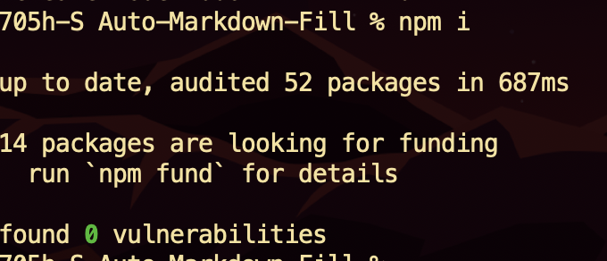
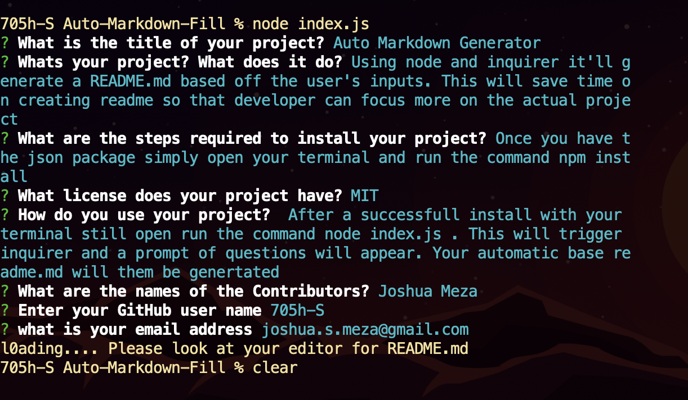

# Auto Markdown Generator

  

  Using node and inquirer it'll generate a README.md based off the user's inputs. This will save time on creating readme so that developer can focus more on the actual project.

  ### Walkthrough

  [Video](https://drive.google.com/file/d/1PwC0mFCtUFdqaRoJZ6NDmP_gAVmyuajx/view)

  ---

  ## TABLE OF CONTENTS

  *[Installation](#Installation)

  *[Usage](#usage)

  *[Contributors](#Contributors)

  * [License](#License)

  --- 

  ## Installation

  Before use make sure you have node installed
  [Node](https://nodejs.org/en/)

  Make sure to have Package.json and on your terminal run " nmp i "

  

  This will install all other dependencies.

  --- 

  ## usage 

   After a successfull install with your terminal still open run the command node index.js . This will trigger inquirer and a prompt of questions will appear. Your automatic base readme.md will them be genertated

  > Questions you'll see on your terminal.

  

  ---

  ## Contributors

  Joshua Meza

  ---

  ## License
        
        Copyright © MIT. All rights reserved. 
    ---
        

  ### Author

  created and built by  
  [705h-S](https://github.com/705h-S)  
 joshua.s.meza@gmail.com

